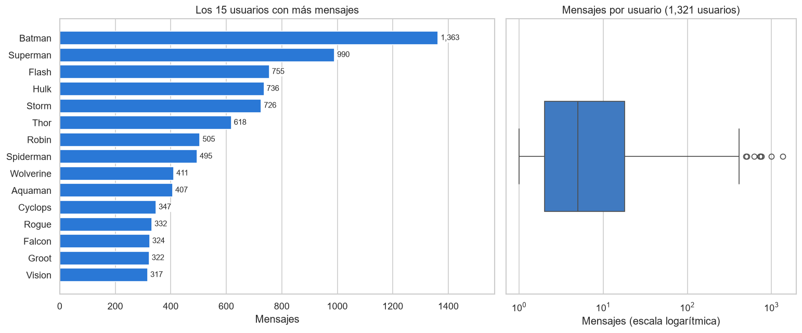
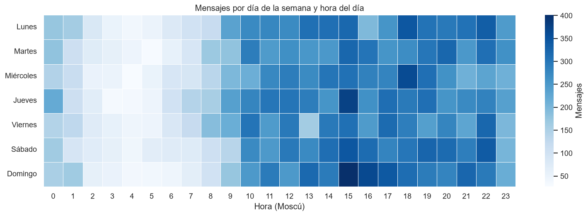
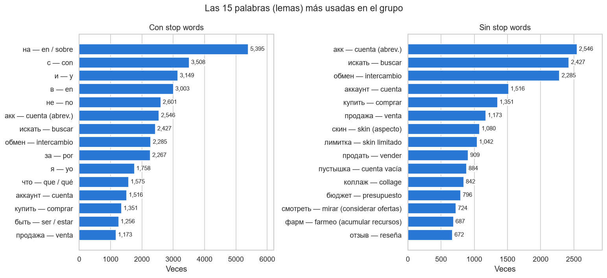
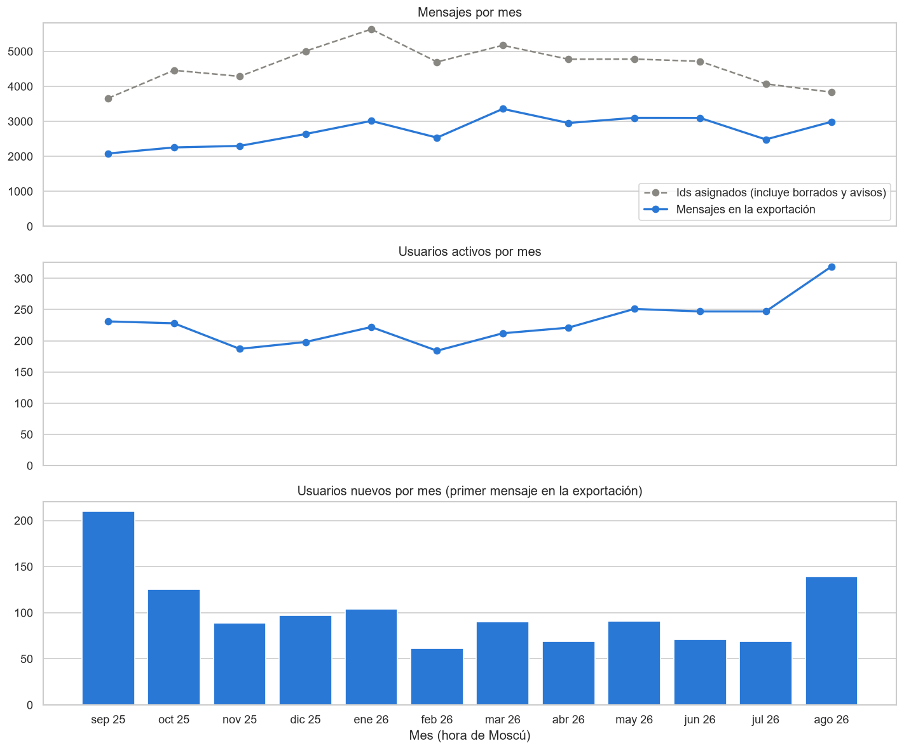

# Análisis de un grupo de Telegram

Tarea de la materia Ingeniería de Características: análisis exploratorio de un chat grupal exportado de
Telegram, desarrollado en una sola libreta Jupyter dentro de un proyecto con estructura
[Cookiecutter Data Science](https://cookiecutter-data-science.drivendata.org/).

El grupo es público, está en ruso y se dedica a la compra, venta e intercambio de cuentas
de un videojuego. La exportación va del 30 de agosto de 2025 al 26 de septiembre de 2026 y
tiene 34,868 mensajes de más de 1,300 usuarios.

La libreta con todo el análisis, ya ejecutada, está en
[`notebooks/1.0-vh-analisis-grupo-telegram.ipynb`](notebooks/1.0-vh-analisis-grupo-telegram.ipynb).

## Preguntas de la tarea

| Sección de la libreta | Pregunta |
|---|---|
| 3 | ¿Qué usuario envía más mensajes? |
| 4 | ¿Cuántas palabras escribe en promedio cada usuario por mensaje de texto? |
| 5 | ¿Quién envía más palabras, emojis y stickers? |
| 6 | ¿Qué días y a qué horas se envían más mensajes? |
| 7 | ¿Qué palabras son las más usadas, en general y por usuario? (con y sin stop words) |
| 8 | ¿Cuáles son los adjetivos más usados? |
| 9 | Preguntas adicionales: actividad por mes, compra, venta o intercambio, y respuestas |
| 10 | Conclusiones |

Las secciones 0 a 2 leen el HTML exportado, anonimizan los datos y construyen la tabla
tidy (una fila por mensaje) con la que se responden todas las preguntas.

## Resumen de resultados

- **La actividad está muy concentrada.** La mitad de los 1,321 usuarios envió 5 mensajes o
  menos, mientras que los 15 más activos suman el 24.8 % del chat. El 80 % de los mensajes
  son fotos y 8,404 son textos repetidos, casi siempre anuncios.

  

- **No hay patrón semanal, pero sí un ritmo diario marcado.** Entre el día más activo y el
  menos activo solo hay un 8 % de diferencia. En hora de Moscú (un supuesto, porque los
  miembros pueden vivir en otras zonas horarias), la actividad casi desaparece entre las
  2:00 y las 6:00, y el 80 % de los mensajes se envía de las 10:00 a las 23:00.

  

- **El vocabulario es el de un mercado.** Sin stop words, las palabras más usadas son
  "акк" (cuenta), "искать" (buscar) y "обмен" (intercambio), junto con jerga del juego.
  Por palabras clave, el 24.9 % de los mensajes con texto habla de compra, el 20.5 % de
  intercambio y el 16.6 % de venta. Es una estimación que cuenta mensajes, no
  transacciones.

  

- **Muchos mensajes se borraron.** Telegram numera los mensajes en orden, y en el rango
  exportado falta el 39.9 % de los números, así que lo más probable es que esos mensajes
  se hayan borrado. Por eso la actividad se ve distinta según qué se cuente: los mensajes
  que quedan (línea azul) llegan a su máximo en marzo de 2026, con 3,356, pero los
  mensajes enviados, incluidos los borrados (línea gris), llegaron a su máximo en enero
  de 2026 y después bajaron. Como de los meses antiguos se ha borrado más, buena parte
  del crecimiento aparente se debe a los borrados.

  

- **Pocas respuestas, pero rápidas.** Solo el 12.9 % de los mensajes son respuestas. La
  mediana del tiempo de respuesta es de 16 minutos y el 73.9 % llega en menos de una hora.

El resto de las gráficas está en [`reports/figures/`](reports/figures/).

## Privacidad

- Los datos no se incluyen en el repositorio: ni la exportación original
  (`data/raw/`) ni las tablas intermedias y procesadas (`data/interim/` y
  `data/processed/`), que tienen los textos de los mensajes.
- Cada usuario aparece con un nombre de superhéroe (por ejemplo, `Batman` o `Flash_2`),
  asignado por orden de actividad. La tabla de equivalencias solo existe en memoria
  mientras se ejecuta la libreta y no se guarda.
- En el texto, las menciones se reemplazan por `@usuario_anon` y se eliminan correos,
  enlaces, números de tarjeta y teléfonos.
- La libreta solo muestra resultados agregados (conteos, promedios, frecuencias), nunca
  mensajes textuales, porque un mensaje citado se podría buscar en el grupo y revelar a su
  autor.

## Estructura del proyecto

```
├── README.md
├── environment.yml             <- Entorno conda ("telegram")
├── requirements.txt            <- Las mismas dependencias para pip
├── data
│   ├── external
│   ├── interim                 <- Tabla cruda leída del HTML (no se versiona)
│   ├── processed               <- Tabla tidy anonimizada (no se versiona)
│   └── raw                     <- Exportación HTML de Telegram (no se versiona)
├── docs
├── models                      <- No se usa en esta tarea
├── notebooks
│   └── 1.0-vh-analisis-grupo-telegram.ipynb   <- Libreta del análisis
├── references
│   ├── diccionario_de_datos.md <- Descripción de las columnas de la tabla tidy
│   └── traducciones_ru_es.csv  <- Traducciones al español de las palabras mostradas
├── reports
│   └── figures                 <- Gráficas generadas por la libreta
└── src
    ├── __init__.py
    └── config.py               <- Rutas del proyecto
```

## Cómo reproducirlo

1. Crear el entorno con Anaconda o Miniconda y descargar el modelo de spaCy para ruso:

   ```bash
   conda env create -f environment.yml
   conda activate telegram
   python -m spacy download ru_core_news_sm
   ```

2. Exportar el chat desde Telegram Desktop en formato HTML y colocar la carpeta en
   `data/raw/ChatExport_2026-09-26/` (o cambiar la ruta en `src/config.py`).
3. Abrir la libreta con el kernel `telegram` y ejecutar todas las celdas. Las stop words
   de nltk se descargan desde la propia libreta.
